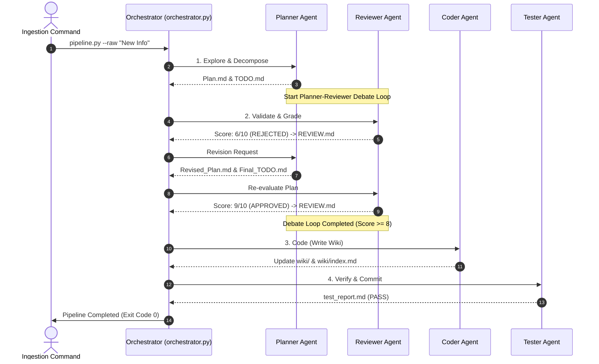

# LLM Wiki Repository & Multi-Agent Ingestion Pipeline

A premium-grade, self-contained, and compounding knowledge management system built upon **Andrej Karpathy's LLM Wiki philosophy** and the architectural lessons of the **Agentic Coding Basics** curriculum.

---

## 🌟 Core Philosophy

Traditional RAG (Retrieval-Augmented Generation) systems are transient, costly, and lack long-term coherence. The **LLM Wiki** shifts knowledge management to a software engineering metaphor:
- **Obsidian** is the IDE where files are visually organized and analyzed.
- **The LLM Agents** act as programmers maintaining, restructuring, and cross-linking files.
- **The Wiki (`wiki/`)** is a persistent, pre-compiled, and evolving codebase of knowledge.

---

## 🏗️ Repository Architecture

This repository is strictly organized to support automated agent orchestration and host-native harness verification:

```
llm_wiki_repository/
├── .pool/               # Agent Pool JSON Specifications
│   ├── planner.json     # Planner Agent spec (Decomposition & planning)
│   ├── reviewer.json    # Reviewer Agent spec (Audit, critique & debate)
│   ├── coder.json       # Coder Agent spec (Markdown compilation & links)
│   └── tester.json      # Tester Agent spec (Validation & schema checks)
├── wiki/                # The Markdown-only Knowledge Base
│   ├── index.md         # The Wiki Homepage / Navigation Portal
│   └── agentic_coding_basics.md  # Compiled course lessons summary
├── specs/               # Standards & Specifications
│   └── schema.md        # The Markdown Formatting & Frontmatter Schema
├── AGENTS.md            # Root context and rules of engagement for all agents
├── TASK.md              # Active checklist contract (Goal, Done when, Log)
├── journal.md           # Append-only chronological history of modifications
├── orchestrator.py      # Multi-agent run loop & ANSI dashboard coordinator
└── pipeline.py          # Command Line Interface (CLI) Ingestion Entrypoint
```

---

## 🚦 Getting Started

The ingestion pipeline is implemented in pure, dependency-free Python and runs immediately.

### 1. Ingest a Raw Item (High-Fidelity Simulation)
To run a complete ingestion run in high-fidelity simulation mode showing the full Planner-Reviewer debate loop, Coder modifications, and Tester verification logs:
```bash
python pipeline.py --demo
```

### 2. Ingest Custom Raw Text
To feed a custom raw knowledge item directly into the multi-agent pipeline:
```bash
python pipeline.py --raw "Ingest the Model Context Protocol details. It defines Client-Server interface protocols."
```

### 3. Ingest From a Source File
To ingest content from a custom document or text file:
```bash
python pipeline.py --file raw_knowledge.txt
```

---

## ⚙️ Ingestion Lifecycle (EPCC Pattern)

Every ingestion run goes through a systematic, multi-agent lifecycle conforming to **Host-Native Harness** standards:



---

## 🛡️ Host-Native Harness Safeguards

As taught in *Lesson 7 (Harness and Skills)*, this repository enforces strict boundaries:
- **Contract-Driven Iteration:** All actions require a clear `Goal` and measurable `Done when` conditions in `TASK.md`.
- **Debate Loop Score:** Plans must score $\ge 8$ to proceed. The first review is capped at $\le 7$ to guarantee iteration.
- **Strict Verification:** The Tester Agent programmatically checks for YAML frontmatter compatibility (conforming to `specs/schema.md`) and verifies relative cross-links. If a link points to a non-existent page, the build fails.
- **Long-term Memory:** All successful updates append a timestamped summary to the immutable `journal.md` log, preserving history across sessions.
